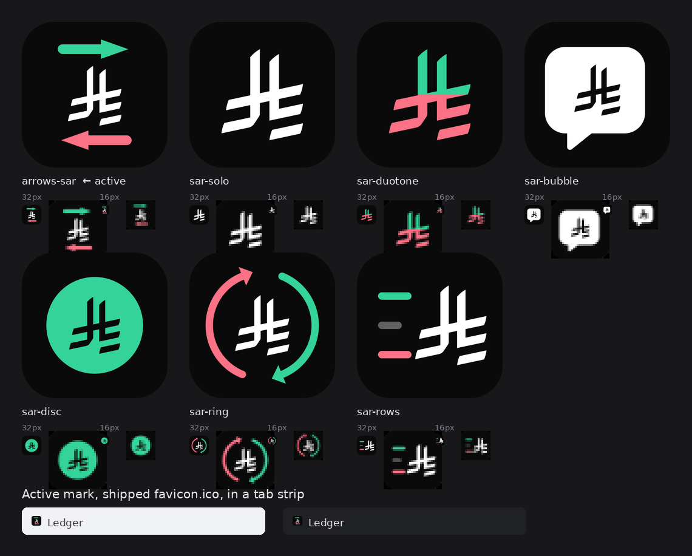

# Brand assets

Design source for the app icon. Nothing here is served — this directory sits
outside `public/` on purpose, so the source files and the preview sheet don't
ride along into the deploy bundle.



## The mark

The Saudi Riyal glyph between two vertical arrows: money out falling on the
left in rose, money in rising on the right in emerald. The arrows flank rather
than compete, so the currency reads as the subject and the direction of travel
reads as context.

Colours match `globals.css` and the transaction colours already used in the UI,
so the icon and the rows in the dashboard agree:

| Role | Hex | Also used for |
|---|---|---|
| Tile | `#0A0A0A` | Dark-mode `--background` |
| Glyph | `#FFFFFF` | — |
| Credit / in | `#34D399` | `emerald-400` amounts |
| Debit / out | `#FB7185` | `rose-400` amounts |

Geometry worth not breaking:

- Both arrows span y 134–378 and are 180° rotations of each other, so the mark
  is symmetric about its centre.
- Shaft and head overlap by 8px. Without it the rounded shaft cap shows as a
  notch where it meets the flat base of the head.
- Ink spans x 55–456, leaving a 55px margin. Anything wider starts to collide
  with the tile's 114px corner radius.
- The glyph is 270 tall and centred, which leaves 22px of air on each side of
  it. Its ink is denser on the left than the right, so it is worth re-measuring
  rather than eyeballing if the size changes.

### A caveat at favicon size

The Riyal glyph is detailed — two stems, a crossbar, three angled bars. At 32px
and up the mark reads cleanly. At 16px the glyph's interior fills in and it
becomes a textured smudge between the two coloured arrows; what survives is the
rose-left / emerald-right colour signature rather than the currency symbol
itself. That is the floor of the format, not a fixable drawing problem.

`arrows-sar-full.svg` is the same artwork with square corners. Android and iOS
mask installed icons themselves, so maskable and apple-touch artwork must not
arrive with rounded corners already baked in or it gets double-rounded.

## The loader is the same mark

`src/components/ui/loader.tsx` is the app's only waiting state: this mark with
the arrows travelling in opposite directions on a shared 1.4s clock, glyph
static between them. Keyframes are `ledger-fall` / `ledger-rise` in
`globals.css`, which also suppresses the travel under `prefers-reduced-motion`.

It redraws the arrows in TSX from the same four constants used here, and takes
the glyph paths from `src/lib/brand.ts` rather than this directory — a `.py`
file cannot be imported by the app. `npm run test:brand` asserts the two copies
still agree on paths, viewBox, colours and arrow geometry, so editing one half
fails loudly rather than quietly shipping a loader that no longer matches the
favicon.

Consequence worth knowing: **changing the arrow geometry below changes the
loader too.** That is the intent, but it means a tweak made for the 16px
favicon also lands in every route transition.

## Where it is wired

Next.js App Router picks these up by filename — no `<link>` tags in `layout.tsx`:

| Path | Emits |
|---|---|
| `src/app/icon.svg` | `<link rel="icon">`, the tab favicon on modern browsers |
| `src/app/favicon.ico` | `/favicon.ico`, multi-resolution 16/32/48/64 for older browsers and bookmark bars |
| `src/app/apple-icon.png` | `<link rel="apple-touch-icon">`, 180×180 full-bleed |
| `public/brand/icon-{192,512}.png` | Referenced by `src/app/manifest.ts` as maskable PWA icons |

`layout.tsx` also sets `viewport.themeColor` to `#0a0a0a` so the browser chrome
and the iOS status bar match the tile.

## Rebuilding

The mark lives in [`build-icons.py`](build-icons.py) rather than as a
hand-edited SVG, so the rounded and square variants cannot drift apart.

```bash
cd web
pip install cairosvg pillow
python3 brand/build-icons.py
```

That regenerates `arrows-sar.svg`, its full-bleed twin and the 512 preview, then
`icon.svg`, `favicon.ico`, `apple-icon.png` and both manifest PNGs.

Then hard-reload — browsers cache favicons aggressively, and a normal refresh
will keep showing the old one.

## Provenance

`Saudi_Riyal_Symbol.svg` is the currency symbol published by the Saudi Central
Bank (SAMA) in 2025. Its two path definitions are inlined verbatim in
`build-icons.py`; only fill and transform are applied.
